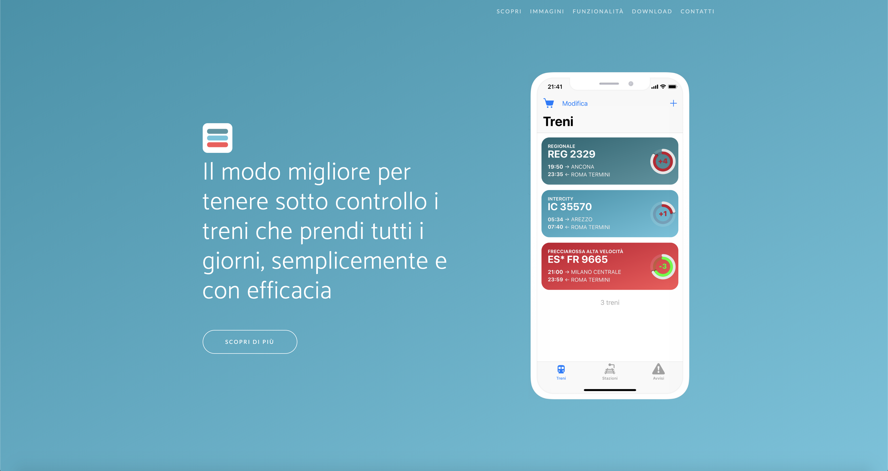
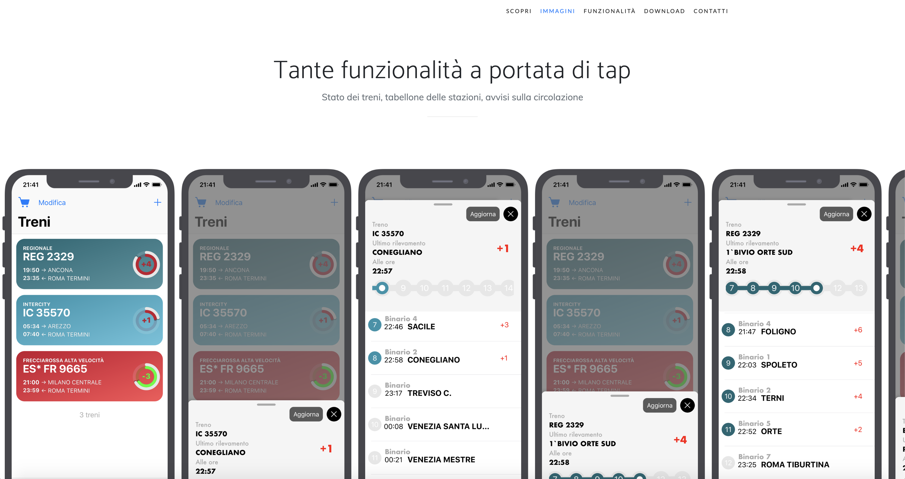
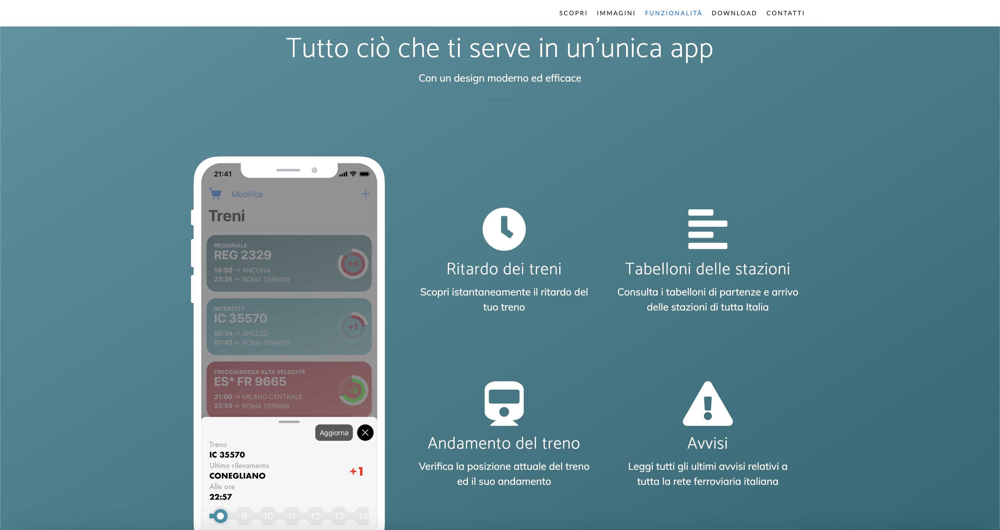

# IlMioTreno website

This is the source code of [https://trains.ernestoschiavo.it](https://trains.ernestoschiavo.it), a single-page portfolio website.

## Screenshots

## Template

It's based on [Bootstrap](https://getbootstrap.com/) and has been built on to of [startbootstrap-new-age](https://github.com/BlackrockDigital/startbootstrap-new-age).

## License
[MIT](https://choosealicense.com/licenses/mit/)
